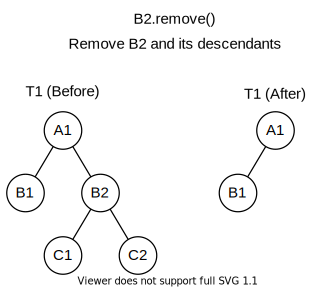

<!-- omit in toc -->
# Guide

<!-- omit in toc -->
### Table Of Contents

- [API](#api)
  - [NTree](#ntree)
    - [`addIndex(String indexName, Function<NTreeNode<K,V>, R> keyGeneratingFunction)`](#addindexstring-indexname-functionntreenodekv-r-keygeneratingfunction)
    - [`addNewRoot(NTreeNode<K,V> newRoot)`](#addnewrootntreenodekv-newroot)
    - [`findAll(Predicate<NTreeNode<K,V>> predicate)`](#findallpredicatentreenodekv-predicate)
    - [`findFirst(Predicate<NTreeNode<K,V>> predicate)`](#findfirstpredicatentreenodekv-predicate)
    - [`findFirstWithId(K id)`](#findfirstwithidk-id)
    - [`findFirstWithValue(V value)`](#findfirstwithvaluev-value)
    - [`forEachNode(TreeTraversalOrder traversal, Consumer<NTreeNode<K,V>> action)`](#foreachnodetreetraversalorder-traversal-consumerntreenodekv-action)
    - [`forEachPreOrder(Consumer<NTreeNode<K,V>> action)`](#foreachpreorderconsumerntreenodekv-action)
    - [`forEachPostOrder(Consumer<NTreeNode<K,V>> action)`](#foreachpostorderconsumerntreenodekv-action)
    - [`forEachLevelOrder(Consumer<NTreeNode<K,V>> action)`](#foreachlevelorderconsumerntreenodekv-action)
    - [`forEachLevelOrderFromBottom(Consumer<NTreeNode<K,V>> action)`](#foreachlevelorderfrombottomconsumerntreenodekv-action)
    - [`forEachOfLeve(int level, Consumer<NTreeNode<K,V>> action)`](#foreachofleveint-level-consumerntreenodekv-action)
    - [`fromJson(String json, Class<K> idClass, Type nodeValueType)`](#fromjsonstring-json-classk-idclass-type-nodevaluetype)
    - [`mapToList(Function<NTreeNode<K,V>,R> function)`](#maptolistfunctionntreenodekvr-function)
    - [`nodesInIndexWithKey(String indexName, R key)`](#nodesinindexwithkeystring-indexname-r-key)
    - [`replaceId(K id)`](#replaceidk-id)
    - [`setRoot(NTreeNode<K,V> node)`](#setrootntreenodekv-node)
    - [`setRootSingleNode(NTreeNode<K,V> node)`](#setrootsinglenodentreenodekv-node)
    - [`treeGraph(Integer width, Integer height, Function<NTreeNode<K,V>,R> dataFunction)`](#treegraphinteger-width-integer-height-functionntreenodekvr-datafunction)
  - [NTreeNode](#ntreenode)
    - [`childrenList(Predicate<NTreeNode<K,V>> predicate)`](#childrenlistpredicatentreenodekv-predicate)
    - [`childrenMap(Predicate<NTreeNode<K,V>> predicate)`](#childrenmappredicatentreenodekv-predicate)
    - [`firstChildWithValue(V value)`](#firstchildwithvaluev-value)
    - [`mapChildrenToList(Function<NTreeNode<K,V>,R> function)`](#mapchildrentolistfunctionntreenodekvr-function)
    - [`mapChildrenToMap(Function<NTreeNode<K,V>,R> function)`](#mapchildrentomapfunctionntreenodekvr-function)
    - [`remove()`](#remove)
    - [`removeAndParentAdoptsGrandChildren(BiPredicate<NTreeNode<K,V>,NTreeNode<K,V>> bipredicate)`](#removeandparentadoptsgrandchildrenbipredicatentreenodekvntreenodekv-bipredicate)
    - [`removeAndParentAdoptsGrandChildren(boolean replacesDuplicates)`](#removeandparentadoptsgrandchildrenboolean-replacesduplicates)
    - [`removeChildren(Predicate<NTreeNode<K,V>> predicate)`](#removechildrenpredicatentreenodekv-predicate)
    - [`retainChildren(Predicate<NTreeNode<K,V>> predicate)`](#retainchildrenpredicatentreenodekv-predicate)
    - [`replaceSingleNodeWith(NTreeNode<K,V> other)`](#replacesinglenodewithntreenodekv-other)
    - [`replaceWith(NTreeNode<K,V> other)`](#replacewithntreenodekv-other)
- [How To's](#how-tos)
  - [Instantiating a tree](#instantiating-a-tree)
  - [Adding all the nodes to a new tree in one statement](#adding-all-the-nodes-to-a-new-tree-in-one-statement)

---

## API

In the this section we show examples of some of the methods for NTree and
NtreeNode classes. We include only some mothods from the API to clarify what
they do. For the rest of the methods you see the Javadocs.

### NTree

---

#### `addIndex(String indexName, Function<NTreeNode<K,V>, R> keyGeneratingFunction)`

Adds an index to this tree to be able to access the nodes from the index without
needing to traverse the tree to find a node.

Example:

```java
NTree<String,Integer> tree = ...
tree.addIndex("idsIndex", node -> node.getId());
tree.addIndex("valuesIndex", node -> node.getValue());
tree.addIndex("numberOfSiblings", node -> node.siblingsList().size());
tree.addIndex("isLeaf", node -> node.childrenSize() == 0);
```

---

#### `addNewRoot(NTreeNode<K,V> newRoot)`

Adds a node as the root of this tree if this tree has no root node set yet. The
node's treeOfBelonging must be the same being added to and the node's parent
must be null.

Example:

```java
NTree<String,Integer> tree = NTree.create("treId");
NTreeNode<String,Integer> root = new NTreeNode<String,Integer>("nodeId");
tree.addNewRoot(root);
```

---

#### `findAll(Predicate<NTreeNode<K,V>> predicate)`

Returns a list of all the nodes for which the provided predicate returns true.

Example:

Assume we have the following tree:


The top part of the nodes represents the id and the bottom part the value.

```java
NTree<String,Integer> tree = ...

// The list will have nodes B2, B3 and the node A1 with a value of 5
List<NTreeNode<String,Integer>> nodesWithValuesGreaterThan2 = tree.findAll(node -> node.getValue() > 2);

// The list will have nodes B1, B2 and B3
List<NTreeNode<String,Integer>> nodesWithIdsStartWithB = tree.findAll(node -> node.getId().startsWith("B"));
```

---

#### `findFirst(Predicate<NTreeNode<K,V>> predicate)`

Returns the first node that satisfies the provided predicate being true when
traversing this tree in a preorder manner to find it. One important thing to be
aware of is that when traversing the tree the order in which the children of a
node are visited is undetermined by default. To change this configure the tree
with `useNaturalOrder()` or`useCustomOrdering(BiFunction<NTreeNode<K,V>,NTreeNode<K,V>,Integer> compareBiFunction)`).

Example:

Assume we have the following tree:


The top part of the nodes represents the id and the bottom part the value.

```java
NTree<String,Integer> tree = ...
tree.useNaturalOrdering();

// This will be the node B1
NTreeNode<String,Integer> firstNodeWithValue2 = tree.findFirst(node -> node.getValue() == 2);

// Now change the ordering so B2 is visited before B1 and hence when traversing
// the tree in preorder manner C1 will be visited first
tree.useCustomOrdering((nodeA,nodeB) -> nodeB.getValue() - nodeA.getIValue());

// This will be the node C1
NTreeNode<String,Integer> firstNodeWithValue2Again = tree.findFirst(node -> node.getValue() == 2);
```

---

#### `findFirstWithId(K id)`

Basically calls `findFirst(Predicate<NTreeNode<K,V>> predicate)` where predicate
is `node -> node.getId().equals(id)`

---

#### `findFirstWithValue(V value)`

Basically calls `findFirst(Predicate<NTreeNode<K,V>> predicate)` where predicate
is `node -> node.getValue().equals(value)`

---

#### `forEachNode(TreeTraversalOrder traversal, Consumer<NTreeNode<K,V>> action)`

Traverses this tree and performs an action for each node. The tree is
traversed in the order specified by the provided `TreeTraversalOrder`
enum. The traversal order between children is unordered by default or if
the tree was configured with `dontUseOrdering()`. Configure this
tree with `useNaturalOrdering()` or `useCustomOrdering(BiFunction)`
for ordered traversal between children.

Example:

Assume we have the following tree:


The top part of the nodes represents the id and the bottom part the value.

```java
NTree<String,Integer> tree = ...

// Prints the values of each node
tree.forEachNode(TreeTraversalOrder.PRE_ORDER, node -> System.out.println(node.getValue()));

// Populates the list with the values of the nodes
List<Integer> valuesList = new LinkedList<>();
tree.forEachNode(TreeTraversalOrder.PRE_ORDER, node -> valuesList.add(node.getValue()));

// Populates the list with the nodes' ids. 
// List will be ["A1", "B1", "B2", "B3", "A1", "C1"]
tree.useNaturalOrdering();
List<String> idsList = new LinkedList<>();
tree.forEachNode(TreeTraversalOrder.LEVEL_ORDER, node -> idsList.add(node.getValue()));

// Adds a child to each node
tree.forEachNode(TreeTraversalOrder.PRE_ORDER, node -> node.addNewChildren(new NTreeNode<String,Integer>("X")));
```

---

#### `forEachPreOrder(Consumer<NTreeNode<K,V>> action)`

Works like [`forEachNode(TreeTraversalOrder traversal, Consumer<NTreeNode<K,V>> action)`](#foreachnodetreetraversalorder-traversal-consumerntreenodekv-action)
but the traversal order is predetermined to be preorder.

---

#### `forEachPostOrder(Consumer<NTreeNode<K,V>> action)`

Works like [`forEachNode(TreeTraversalOrder traversal, Consumer<NTreeNode<K,V>> action)`](#foreachnodetreetraversalorder-traversal-consumerntreenodekv-action)
but the traversal order is predetermined to be postorder.

---

#### `forEachLevelOrder(Consumer<NTreeNode<K,V>> action)`

Works like [`forEachNode(TreeTraversalOrder traversal, Consumer<NTreeNode<K,V>> action)`](#foreachnodetreetraversalorder-traversal-consumerntreenodekv-action)
but the traversal order is predetermined to be levelorder.

---

#### `forEachLevelOrderFromBottom(Consumer<NTreeNode<K,V>> action)`

Works like [`forEachNode(TreeTraversalOrder traversal, Consumer<NTreeNode<K,V>> action)`](#foreachnodetreetraversalorder-traversal-consumerntreenodekv-action)
but the traversal order is predetermined to be levelorder but from deepest node
up to root.

---

#### `forEachOfLeve(int level, Consumer<NTreeNode<K,V>> action)`

Works similar to [`forEachNode(TreeTraversalOrder traversal, Consumer<NTreeNode<K,V>> action)`](#foreachnodetreetraversalorder-traversal-consumerntreenodekv-action)
but traverses only the nodes in the specified level.

Example:

Assume we have the following tree:


The top part of the nodes represents the id and the bottom part the value.

```java
NTree<String,Integer> tree = ...

// Prints B1 B2 B3
tree.forEachOfLevel(2, node -> System.out.print(node.getId() + " "));
```

---

#### `fromJson(String json, Class<K> idClass, Type nodeValueType)`

Returns a JSON string representation of this tree. The nodeValueType and the
tree indexes are not included in the JSON string.

Example:

```java
NTree<String,Integer> tree = ...
String json = tree.toJson();
Type nodeValueType = new TypeToken<Integer>() {}.getType();
NTree<String,Integer> tree2 = fromJson(json, String.getClass(), nodeValueType);
```

---


#### `mapToList(Function<NTreeNode<K,V>,R> function)`

Returns a List of values that are the result of the execution of the provided
mapping function to each node in this tree.

Example:

Assume we have the following tree:


The top part of the nodes represents the id and the bottom part the value.

```java
NTree<String,Integer> tree = ...

// List will have the ids of the nodes in the tree
List<String> ids = tree.mapToList(node -> node.getId());

// List will have the results of multuplying every node value by 2
List<Integer> valuesX2 = tree.mapToList(node -> node.getValue()*2);
```

Note that if the lambda function passed throws an exception it will return null
and it will be in the returned list. So if all nodes had null values and you
applied the last statement above the resulting list will have all items being null.

---

#### `nodesInIndexWithKey(String indexName, R key)`

Example:

Assume we have the following tree:


The top part of the nodes represents the id and the bottom part the value.

If the tree has the same indexes as the example above for
`addIndex(String,Function)` then,

```java
NTree<String,Integer> tree = ...

// list will have the two nodes with id A1. One is the root and the other is the
// child of node B2 that has a value of 5
List<NTreeNode<String,Integer>> hasIdA1 = tree.nodesInIndexWithKey("idsIndex", "A1");

// list will have the two nodes that have a value of 2. One is node B1 and the other
// is node C1
List<NTreeNode<String,Integer>> hasIdA1 = tree.nodesInIndexWithKey("valuesIndex", 2);

// list will have nodes B1, B2 and B3 which are the only ones to have 2 siblings.
List<NTreeNode<String,Integer>> hasIdA1 = tree.nodesInIndexWithKey("numberOfSiblings", 2);

// list will have nodes B1, B3, C1 and the node A1 that has the value of 5
List<NTreeNode<String,Integer>> hasIdA1 = tree.nodesInIndexWithKey("isLeaf", true);
```

---

#### `replaceId(K id)`

Replaces the id of the tree.

Example:

```java
NTree<String,Integer> tree = NTree.create("id");
tree.replaceId("newId");
```

---

#### `setRoot(NTreeNode<K,V> node)`

Creates a clone of the node and its descendants and sets the clone as root of
the tree.

Example:

```java
NTree<String,Integer> tree = ...
NTreeNode<String,Integer> root = ...
tree.setRoot(root);
```

Conceptual Diagram:


---

#### `setRootSingleNode(NTreeNode<K,V> node)`

Creates a clone of the node and sets the clone as the root of the tree and leaves
the old root's children as they were.

Example:

```java
NTree<String,Integer> tree = ...
NTreeNode<String,Integer> root = ...
tree.setRootSingleNode(root);
```

Conceptual Diagram:


---

#### `treeGraph(Integer width, Integer height, Function<NTreeNode<K,V>,R> dataFunction)`

Returns a simple graphic representation of this tree in a string. The dataFunction
argument passed is used to display data about the node.

Example:

```java
NTree<String,Integer> t = NTree.create("tree");
t.addNewRoot(
  t.n("A1").c(
    t.n("B1").c(
      t.n("C1").c(
        t.n("D1",1)
      )
    ),
    t.n("B2").c(
      t.n("C2").c(
        t.n("D2",2)
      ),
      t.n("C3",3)
    ),
    t.n("B3").c(
      t.n("C4").c(
        t.n("D3").c(
          t.n("E1",4)
        )
      ),
      t.n("C5",5)
    ),
    t.n("B4")
  )
);

String graph = t.root.treeGraph(3, 2, node -> node.getValue());
System.out.println(graph);
```

The printed output will be:

```
A1: null
│
└──B1: null
│  │
│  └──C1: null
│     │
│     └──D1: 1
│
└──B2: null
│  │
│  └──C2: null
│  │  │
│  │  └──D2: 2
│  │
│  └──C3: 3
│
└──B3: null
│  │
│  └──C4: null
│  │  │
│  │  └──D3: null
│  │     │
│  │     └──E1: 4
│  │
│  └──C5: 5
│
└──B4: null

```

---

### NTreeNode

---

#### `childrenList(Predicate<NTreeNode<K,V>> predicate)`

Returns a `List` of this node's children for which the provided `Predicate`
evaluates to `true`.

Assume we have the following tree:


The top part of the nodes represents the id and the bottom part the value.

```java
NTree<String,Integer> tree = ...

// The list will have nodes B1 and B3
List<NTreeNode<String,Integer>> childrenEvenValues = tree.getRoot().childrenList(node -> node.getValue() % 2 == 0);
```

---

#### `childrenMap(Predicate<NTreeNode<K,V>> predicate)`

Similar to [`childrenList(Predicate<NTreeNode<K,V>> predicate)`](#childrenlistpredicatentreenodekv-predicate)
but returns a `Map` of children where the keys of the map are the children Ids.

---

#### `firstChildWithValue(V value)`

Returns the first child it finds that has a value that is equal to the one provided.
The traversal order between the childs of this node is not ordered by default.
This can be changed by configuring this node's treeOfBelonging using
`useNaturalOrdering()` or `useCustomOrdering(BiFunction<NTreeNode<K,V>,NTreeNode<K,V>,Integer> compareBiFunction)`.

Assume we have the following tree:


The top part of the nodes represents the id and the bottom part the value.

```java
NTree<String,Integer> tree = ...

// Could be node B1 or B3
NTreeNode<String,Integer> firstWithValue2 = tree.getRoot().firstChildWithValue(2);

// Will be node B1
tree.useNaturalOrdering();
NTreeNode<String,Integer> b1 = tree.getRoot().firstChildWithValue(2);

// Will be node B3
tree.useCustomOrdering((nodeA, nodeB) -> nodeB.getValue() - nodeA.getValue());
NTreeNode<String,Integer> b3 = tree.getRoot().firstChildWithValue(2);
```

---

#### `mapChildrenToList(Function<NTreeNode<K,V>,R> function)`

Returns a `List` of the results of applying the provided `Function`
to each of this node's children.

Example:

Assume we have the following tree:


The top part of the nodes represents the id and the bottom part the value.

```java
NTree<String,Integer> tree = ...

// The list will have values [4, 2, 4, 2] although not necesarily in that order
List<Integer> childrenValuesX2 = tree.getRoot().mapChildrenToList(node -> node.getValue() * 2);
```

---

#### `mapChildrenToMap(Function<NTreeNode<K,V>,R> function)`

Similar to

except that it reurns a `Map`instead of a `List`. The map keys will be the keys
of the children ids.

---

#### `remove()`

Removes a node and its descendants.

Example:

Assume we have the following tree:



```java
NTree<String,Integer> tree = ...
tree.getRoot().childWithId("B2").remove();
```

---

#### `removeAndParentAdoptsGrandChildren(BiPredicate<NTreeNode<K,V>,NTreeNode<K,V>> bipredicate)`

Removes the node and it's parent adopts the nodes children. The result of the
`BiPpredicate` determines if the child or the sibling of the node is replaced in
the case that they hace the same ids.

Example:

```java
NTree<String,Integer> tree = ...

tree.getRoot().childWithId("B2").removeAndParentAdoptsGrandchildren((child,uncle) -> child.getValue() > uncle.getValue());
```

or

```java
NTree<String,Integer> tree = ...

tree.getRoot().childWithId("B2").removeAndParentAdoptsGrandchildren((child,uncle) -> child.getValue() < uncle.getValue());
```

Conceptual Diagram:


---

#### `removeAndParentAdoptsGrandChildren(boolean replacesDuplicates)`

Works in the same way as
[`removeAndParentAdoptsGrandChildren(BiPredicate<NTreeNode<K,V>,NTreeNode<K,V>> bipredicate)`](#removeandparentadoptsgrandchildrenbipredicatentreenodekvntreenodekv-bipredicate)
but instead of passing a BiPredicate you pass a boolean to determine if childs
of this node that have the same id as siblings of this node replace this nodes
siblings.

---

#### `removeChildren(Predicate<NTreeNode<K,V>> predicate)`

Removes the child nodes of this node for which the provided `Predicate`
evaluates to `true`.

Example:

Assume we have the following tree:


The top part of the nodes represents the id and the bottom part the value.

```java
NTree<String,Integer> tree = ...

// Will remove A1 childs B1 and B3
tree.getRoot().removeChildren(node -> node.getValue() == 2);
```

---

#### `retainChildren(Predicate<NTreeNode<K,V>> predicate)`

Removes all of this node's children for which the provided `Predicate`
evaluates to `false` and retaining those childs for which it evaluates to `true`.

Example:

Assume we have the following tree:


The top part of the nodes represents the id and the bottom part the value.

```java
NTree<String,Integer> tree = ...

// Will remove A1 childs B2 and B4 and leave B1 and B3
tree.getRoot().retainChildren(node -> node.getValue() == 2);
```

---

#### `replaceSingleNodeWith(NTreeNode<K,V> other)`

Replaces this node in a node hierarchy or tree with another node without
replacing the node's descendants. The node passed will not be changed and
instead a clone of it will be used.

This method is similar to [`setRootSingleNode(NTreeNode<K,V> node)`](#setrootsinglenodentreenodekv-node)
but instead of setting the root of a tree it replaces the node that calls this
method with another node.

---

#### `replaceWith(NTreeNode<K,V> other)`

Replaces this node in a node hierarchy or tree with another node and the
other node's descendants. The node passed will not be changed and
instead a clone of it will be used.

This method is similar to [`setRoot(NTreeNode<K,V> node)`](#setrootntreenodekv-node)
but instead of setting the root of a tree it replaces the node and descendants
of the node that calls this method with another node and its descendants.

---

## How To's

### Instantiating a tree

There are two ways to create an instance of `NTree`, one is using the
constructor and the other the static factory method `create(Object)`.

```java
NTree<String,Integer> tree1 = new NTree<>("treeId1");
NTree<String,Integer> tree2 = NTree.create("treeId2");
```

### Adding all the nodes to a new tree in one statement

Examples on how to create the following tree:


```java
NTree<String,Integer> t = new NTree<>("tree");
t.addNewRoot(
    t.n("A1").c(
        t.n("B1"),
        t.n("B2").c(
            t.n("C1"),
            t.n("C2")
        )
    )
);
```

```java
NTree<String,Integer> t2 = new NTree<>("tree2");
t2.addNewRoot(
    t2.createNode("A1").addNewChildren(
        t2.createNode("B1"),
        t2.createNode("B2").addNewChildren(
            t2.createNode("C1"),
            t2.createNode("C2")
        )
    )
);
```
