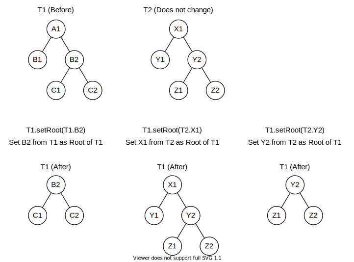
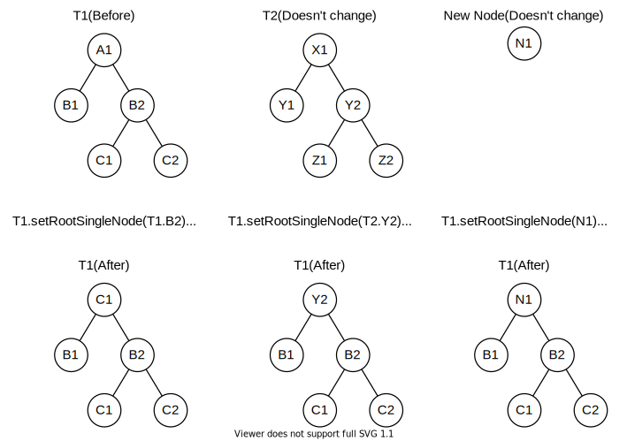
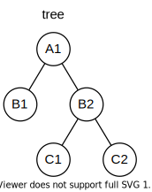

<!-- omit in toc -->
# Guide

<!-- omit in toc -->
### Table Of Contents

- [API](#api)
  - [NTree](#ntree)
    - [`replaceId(K id)`](#replaceidk-id)
    - [`addNewRoot(NTreeNode<K,V> newRoot)`](#addnewrootntreenodekv-newroot)
    - [`setRoot(NTreeNode<K,V> node)`](#setrootntreenodekv-node)
    - [`setRootSingleNode(NTreeNode<K,V> node)`](#setrootsinglenodentreenodekv-node)
    - [`addIndex(String indexName, Function<NTreeNode<K,V>, R> keyGeneratingFunction)`](#addindexstring-indexname-functionntreenodekv-r-keygeneratingfunction)
    - [`nodesInIndexWithKey(String indexName, R key)`](#nodesinindexwithkeystring-indexname-r-key)
    - [`fromJson(String json, Class<K> idClass,  Type nodeValueType)`](#fromjsonstring-json-classk-idclass--type-nodevaluetype)
    - [`findAll(Predicate<NTreeNode<K,V>> predicate)`](#findallpredicatentreenodekv-predicate)
    - [`findFirst(Predicate<NTreeNode<K,V>> predicate)`](#findfirstpredicatentreenodekv-predicate)
    - [`findFirstWithId(K id)`](#findfirstwithidk-id)
    - [`findFirstWithValue(V value)`](#findfirstwithvaluev-value)
  - [NTreeNode](#ntreenode)
  - [NearestCommonAncestorTool](#nearestcommonancestortool)
- [How To's](#how-tos)
  - [Instantiating a tree](#instantiating-a-tree)
  - [Adding all the nodes to a new tree in one statement](#adding-all-the-nodes-to-a-new-tree-in-one-statement)

---

## API

In the this section we show examples of some of the methods for NTree, NtreeNode
and NearestCommonAncestorTool classes. Only the methods which are not too simple
or too obvios as to what they do or how to use them are covered here. The javadocs
should suffice for the methods not covered in this guide.

### NTree

#### `replaceId(K id)`

Replaces the id of the tree.

Example:

```java
NTree<String,Integer> tree = NTree.create("id");
tree.replaceId("newId");
```

---

#### `addNewRoot(NTreeNode<K,V> newRoot)`

Adds a node as the root of this tree if this tree has no root node set yet. The
node's treeOfBelonging must be the same being added to and the node's parent
must be null.

Example:

```java
NTree<String,Integer> tree = NTree.create("treId");
NTreeNode<String,Integer> root = new NTreeNode<String,Integer>("nodeId");
tree.addNewRoot(root);
```

---

#### `setRoot(NTreeNode<K,V> node)`

Creates a clone of the node and its descendants and sets the clone as root of
the tree.

Example:

```java
NTree<String,Integer> tree = ...
NTreeNode<String,Integer> root = ...
tree.setRoot(root);
```

Conceptual Diagram:



---

#### `setRootSingleNode(NTreeNode<K,V> node)`

Creates a clone of the node and sets the clone as the root of the tree and leaves
the old root's children as they were.

Example:

```java
NTree<String,Integer> tree = ...
NTreeNode<String,Integer> root = ...
tree.setRootSingleNode(root);
```

Conceptual Diagram:



---

#### `addIndex(String indexName, Function<NTreeNode<K,V>, R> keyGeneratingFunction)`

Adds an index to this tree to be able to access the nodes from the index without
needing to traverse the tree to find a node.

Example:

```java
NTree<String,Integer> tree = ...
tree.addIndex("idsIndex", node -> node.getId());
tree.addIndex("valuesIndex", node -> node.getValue());
tree.addIndex("numberOfSiblings", node -> node.siblingsList().size());
tree.addIndex("isLeaf", node -> node.childrenSize() == 0);
```

---

#### `nodesInIndexWithKey(String indexName, R key)`

Example:

Assume we have the following tree:


The top part of the nodes represents the id and the bottom part the value.

If the tree has the same indexes as the example above for
`addIndex(String,Function)` then,

```java
NTree<String,Integer> tree = ...

// list will have the two nodes with id A1. One is the root and the other is the
// child of node B2 that has a value of 5
List<NTreeNode<String,Integer>> hasIdA1 = tree.nodesInIndexWithKey("idsIndex", "A1");

// list will have the two nodes that have a value of 2. One is node B1 and the other
// is node C1
List<NTreeNode<String,Integer>> hasIdA1 = tree.nodesInIndexWithKey("valuesIndex", 2);

// list will have nodes B1, B2 and B3 which are the only ones to have 2 siblings.
List<NTreeNode<String,Integer>> hasIdA1 = tree.nodesInIndexWithKey("numberOfSiblings", 2);

// list will have nodes B1, B3, C1 and the node A1 that has the value of 5
List<NTreeNode<String,Integer>> hasIdA1 = tree.nodesInIndexWithKey("isLeaf", true);
```

---

#### `fromJson(String json, Class<K> idClass,  Type nodeValueType)`

Returns a JSON string representation of this tree. The nodeValueType and the
tree indexes are not included in the JSON string.

Example:

```java
NTree<String,Integer> tree = ...
String json = tree.toJson();
Type nodeValueType = new TypeToken<Integer>() {}.getType();
NTree<String,Integer> tree2 = fromJson(json, String.getClass(), nodeValueType);
```

#### `findAll(Predicate<NTreeNode<K,V>> predicate)`

Returns a list of all the nodes for which the provided predicate returns true.

Example:

Assume we have the following tree:


The top part of the nodes represents the id and the bottom part the value.

```java
NTree<String,Integer> tree = ...

// The list will have nodes B2, B3 and the node A1 with a value of 5
List<NTreeNode<String,Integer>> nodesWithValuesGreaterThan2 = tree.findAll(node -> node.getValue() > 2);

// The list will have nodes B1, B2 and B3
List<NTreeNode<String,Integer>> nodesWithIdsStartWithB = tree.findAll(node -> node.getId().startsWith("B"));
```

---

#### `findFirst(Predicate<NTreeNode<K,V>> predicate)`

Returns the first node that satisfies the provided predicate being true when
traversing this tree in a preorder manner to find it. One important thing to be
aware of is that when traversing the tree the order in which the children of a
node are visited is undetermined by default. To change this configure the tree
with `useNaturalOrder()` or`useCustomOrdering(BiFunction<NTreeNode<K,V>,NTreeNode<K,V>,Integer> compareBiFunction)`).

Example:

Assume we have the following tree:


The top part of the nodes represents the id and the bottom part the value.

```java
NTree<String,Integer> tree = ...
tree.useNaturalOrdering();

// This will be the node B1
NTreeNode<String,Integer> firstNodeWithValue2 = tree.findFirst(node -> node.getValue() == 2);

// Now change the ordering so B2 is visited before B1 and hence when traversing
// the tree in preorder manner C1 will be visited first
tree.useCustomOrdering((nodeA,nodeB) -> nodeB.getValue() - nodeA.getIValue());

// This will be the node C1
NTreeNode<String,Integer> firstNodeWithValue2Again = tree.findFirst(node -> node.getValue() == 2);
```

---

#### `findFirstWithId(K id)`

Basically calls `findFirst(Predicate<NTreeNode<K,V>> predicate)` where predicate
is `node -> node.getId().equals(id)`

---

#### `findFirstWithValue(V value)`

Basically calls `findFirst(Predicate<NTreeNode<K,V>> predicate)` where predicate
is `node -> node.getValue().equals(value)`

---

!!!!!!!!!!!!!!!!!!!!!!!!!!!!!!!!!!!!!!!!
!!!!!!!!!!!!!!!!!!!!!!!!!!!!!!!!!!TODO

### NTreeNode

### NearestCommonAncestorTool

## How To's

### Instantiating a tree

There are two ways to create an instance of `NTree`, one is using the
constructor and the other the static factory method `create(Object)`.

```java
NTree<String,Integer> tree1 = new NTree<>("treeId1");
NTree<String,Integer> tree2 = NTree.create("treeId2");
```

### Adding all the nodes to a new tree in one statement

Examples on how to create the following tree:



```java
NTree<String,Integer> t = new NTree<>("tree");
t.addNewRoot(
    t.n("A1").c(
        t.n("B1"),
        t.n("B2").c(
            t.n("C1"),
            t.n("C2")
        )
    )
);
```

```java
NTree<String,Integer> t2 = new NTree<>("tree2");
t2.addNewRoot(
    t2.createNode("A1").addNewChildren(
        t2.createNode("B1"),
        t2.createNode("B2").addNewChildren(
            t2.createNode("C1"),
            t2.createNode("C2")
        )
    )
);
```
